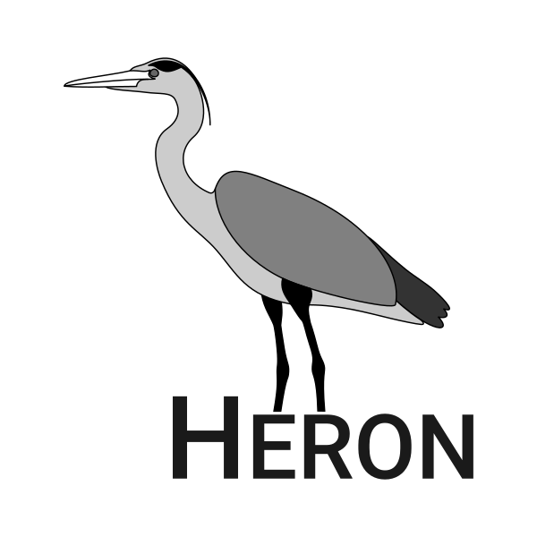

.. inclusion-marker-do-not-remove

Introduction
------------

SCINE Heron is the graphical user interface for all other SCINE modules. It has two main ways of operation.

First, one can explore chemical reactivity immersively and interactively based on first principles. The
graphical user interface of SCINE Heron displays a three-dimensional molecular structure and allows users
to interact with it. They can induce structural changes with a computer mouse or a haptic device and perceive
the effect of their manipulations immediately through visual and/or haptic feedback. For fast electronic
structure calculations, we employ currently different semi-empirical methods, which can deliver properties
in the millisecond timescale, while providing a qualitatively correct description of the potential energy surface.

Second, one can interact with explorations done by SCINE Chemoton. One can visualize the chemical reaction
network without drowning in too much information. For example, one can selectively display reactions with a
barrier lower than a certain, user-specified threshold. Furthermore, one can analyze all compounds and reactions
discovered, e.g., for reactions, one can visualize the trajectory and study the energy along it. It is also possible
to search and visualize all pathways between two given compounds. Any compound discovered by Chemoton can be
transferred to the interactive part of the GUI, allowing it to be further studied.

License and Copyright Information
---------------------------------

For license and copyright information, see the file ``LICENSE.txt`` in this
directory.

Installation
------------

Prerequisites
.............

The application requires several third-party and SCINE related Python packages to run.
These packages can be installed using the following command::

    pip install -r requirements.txt

You may want to create and activate a virtual environment first.

Additional third party packages are used for testing, type checking, and formatting.
See ``requirements-dev.txt`` and pypi.org for more information.
Again, the packages can be installed using::

    pip install -r requirements-dev.txt

Installation
............

Heron can be installed using pip (pip3) once the repository has been cloned:

.. code-block:: bash

   git clone <heron-repo>
   pip install ./heron

A non super user can install the package using a virtual environment, or
the ``--user`` flag.

Usage
------

Starting the Application
........................

The application can be started by the command::

    python3 -m scine_heron

To open a file with molecule directly from the command line, you can use the ``--file`` option::

    python3 -m scine_heron --file examples/xyz_files/pyridine.xyz

The application is per default in dark mode. If light mode is preferred, you can use the ``--mode`` option::

    python3 -m scine_heron --mode light

Shortcuts
.........

The application features a range of shortcuts, a few are given here.

General:
 - Scrolling Vertically: Mouse Wheel
 - Scrolling Vertically: Shift + Mouse Wheel
 - Zooming: Ctrl + Mouse Wheel (in the main molecular viewer also without Ctrl modifier)
 - Open Database Connection Dialogue: Ctrl + D

Main Molecular Viewer:
 - Open File: Ctrl + O
 - Save Molecule: Ctrl + S
 - Save Trajectory: Ctrl + Shift + S
 - Start Real Time Calculation: Ctrl + F (if calculator is available and molecule loaded)

All Network Views:
  - Copy ID of Focussed Node: Ctrl + C

Haptic Device
-------------

SCINE Heron supports the usage of a haptic device.
It allows the user to feel force feedback when manipulating molecules in the
main molecular viewer.
In order to install and connect a haptic device to SCINE Heron please read the
instructions and referenced manuals below.

Haptic Device Install
.....................

Connect your haptic device. Download `drivers <https://s3.amazonaws.com/dl.3dsystems.com/binaries/Sensable/Linux/TouchDriver2019_2_15_Linux.tar.xz>`_
for it and install according to the `instructions <https://s3.amazonaws.com/dl.3dsystems.com/binaries/Sensable/Linux/Installation+Instructions.pdf>`_.
Read the `official webpage <https://support.3dsystems.com/s/article/OpenHaptics-for-Linux-Developer-Edition-v34?language=en_US>`_ for more information.

Install `OpenHaptics SDK <https://s3.amazonaws.com/dl.3dsystems.com/binaries/support/downloads/KB+Files/Open+Haptics/openhaptics_3.4-0-developer-edition-amd64.tar.gz>`_.
Read the `Programmers Guide <https://s3.amazonaws.com/dl.3dsystems.com/binaries/support/downloads/KB+Files/Open+Haptics/OpenHaptics_ProgGuide.pdf>`_
and `API Reference Guide <https://s3.amazonaws.com/dl.3dsystems.com/binaries/support/downloads/KB+Files/Open+Haptics/OpenHaptics_RefGuide.pdf>`_
for more information.

Then install the ``scine_heron_haptic`` module (see the instructions in the ``haptics/`` subfolder).

How to Cite
-----------

When publishing results obtained with Heron, please cite the corresponding
release as archived on `Zenodo <https://zenodo.org>`_ (please use the DOI of
the respective release).

Support and Contact
-------------------

In case you should encounter problems or bugs, please write a short message
to scine@phys.chem.ethz.ch.
